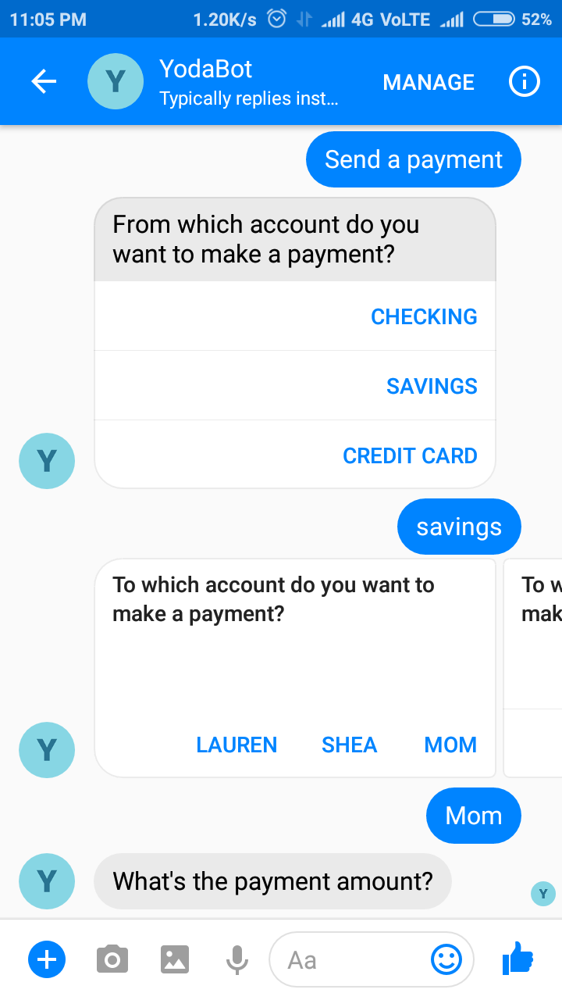

# Oracle Mobile Cloud Platform for Chatbots

This repository contains the chatbot i built using Oracle Mobile Cloud platofrm as part of the oracle's chatbot training MOOC.

This Chatbot is built using Oracle Mobile Cloud Platform which allows users to find balances in their banking accounts, transfer money between banking accounts, and send money to different people and accounts.

