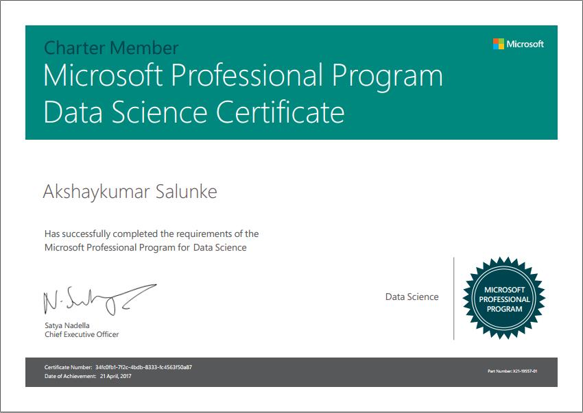
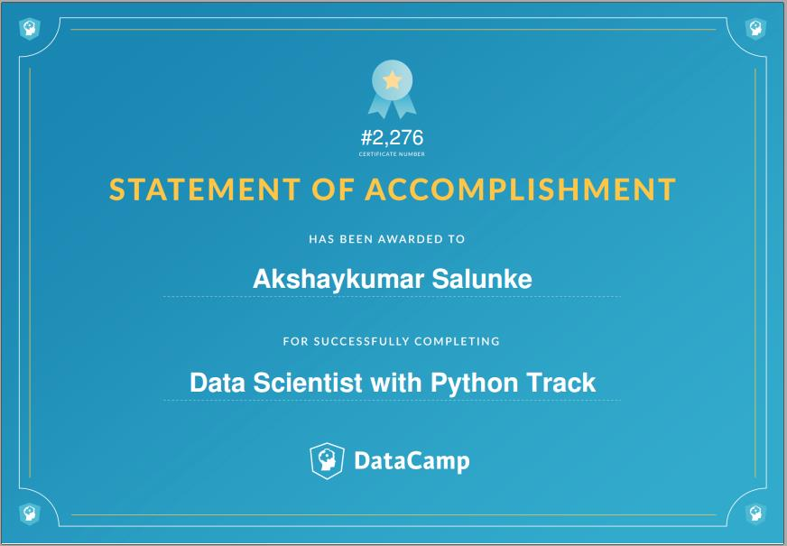
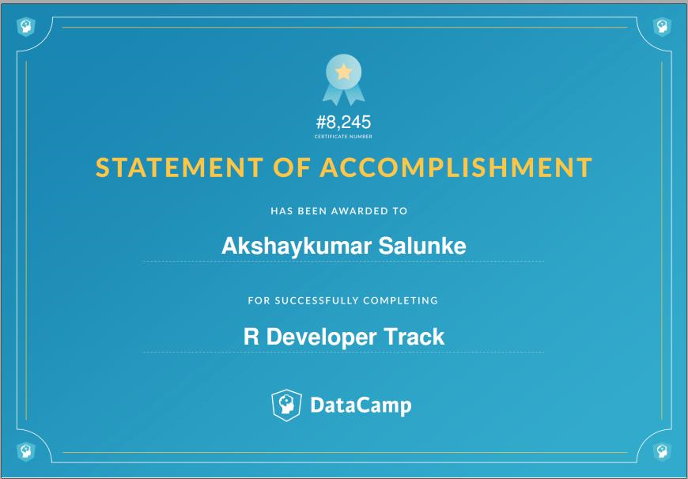

# Gallary of certificates.

Courses Completed by Akshaykumar Salunke.

---

### Certificate in Data Science

- Python
  1. Python Developer
  2. Data Anayst with python
  3. Data Scientist with python

- R
  1. R Developer
  2. Data Analyst with R
  3. Data Scientist with R

---

---

---

---

---

---

---

---

## Certificates in Big Data Technology

---

---

---

---

---